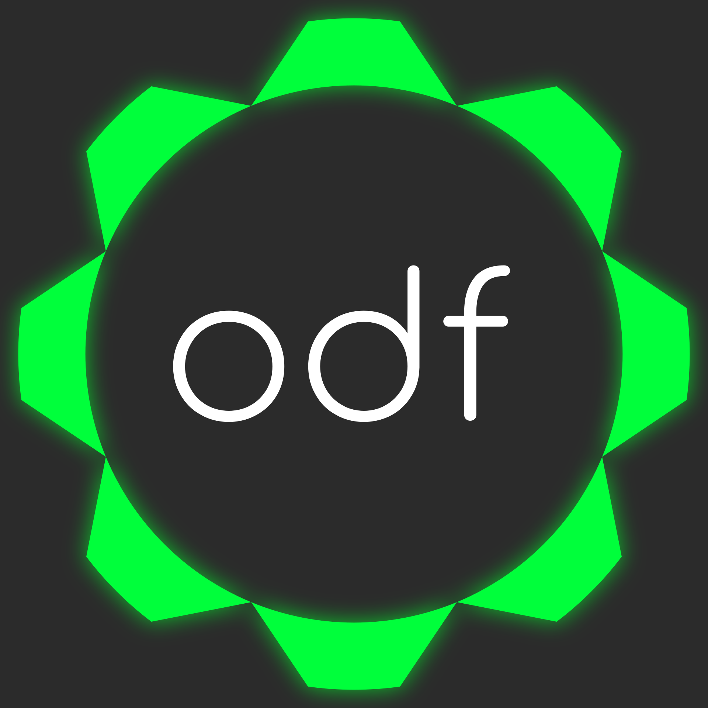
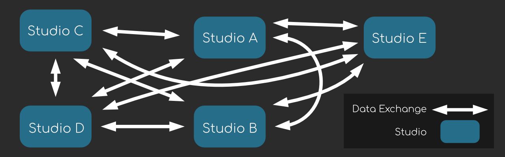
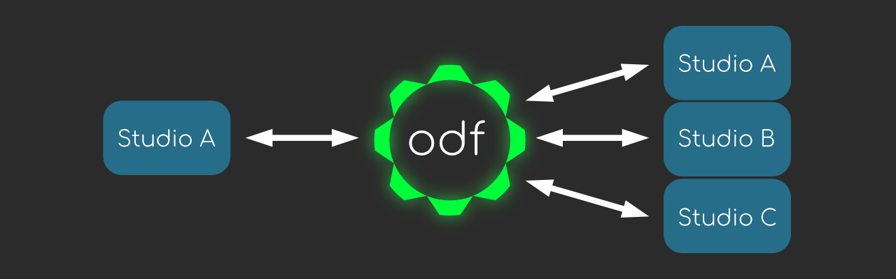

.. OpenDeliveryFormat - some fun stuff

******************
OpenDeliveryFormat
******************

What Is It?
-----------
OpenDeliveryFormat, ODF for short, is both an interchange protocol and packaging system for the VFX and Animation industries. ODF is built with the sole purpose of making it easier to work together. This includes across facilities, tracking software, nomenclature, and more.

To put it into context, if `USD <https://graphics.pixar.com/usd/docs/Introduction-to-USD.html>`_ is the definition of any scene, ODF is the definition of any package, containing work or deliverables for an external party or within two different systems of a pipeline.

Some basic examples might be:

* You need to present a set of images sequences and elements for another firm to comp a shot
* Outsource plates for roto with an annotation and notes
* Pass a model to a third party rigging client
* Passing back and forth caches, USDs, or other forms of scene description 
* Update another parties tracking software with your own internal work

On top of all this, ODF is built from the ground up to scale with the industry. With a plugin interface for generating new Components (more on these later), we can create a means of translating from one pipeline to another even as requirements change.

Background
----------
The VFX/Animation industry as a whole deals with a massive number of formats, information, terminology, pipelines, and otherwise. OpenDeliveryFormat was conceived when a development team was dealing with a huge number of vendors with different flavors of content delivery.

Many of these "packages" contained the same kind of work but with slight variations in the folder structure, naming conventions, or otherwise. It ended up looking like the following diagram.

Each arrow in that figure comes with it's own set of production management to both build the package as well as unpack and bring it into that studios system. This results in ever-increasing overhead to handle these interchanges.

The Fix
-------

OpenDeliveryFormat is a standard means of moving content between any two or more studios.

To rationalize all these data types, ODF uses a simple structure to abstract specification definition, and work/delivery listing.

.. toctree::
   :maxdepth: 2
   :caption: Introduction:

   introduction/words
   introduction/packaging
..    introduction/spec
..    introduction/manifest

Indices and tables
==================

* :ref:`genindex`
* :ref:`modindex`
* :ref:`search`

