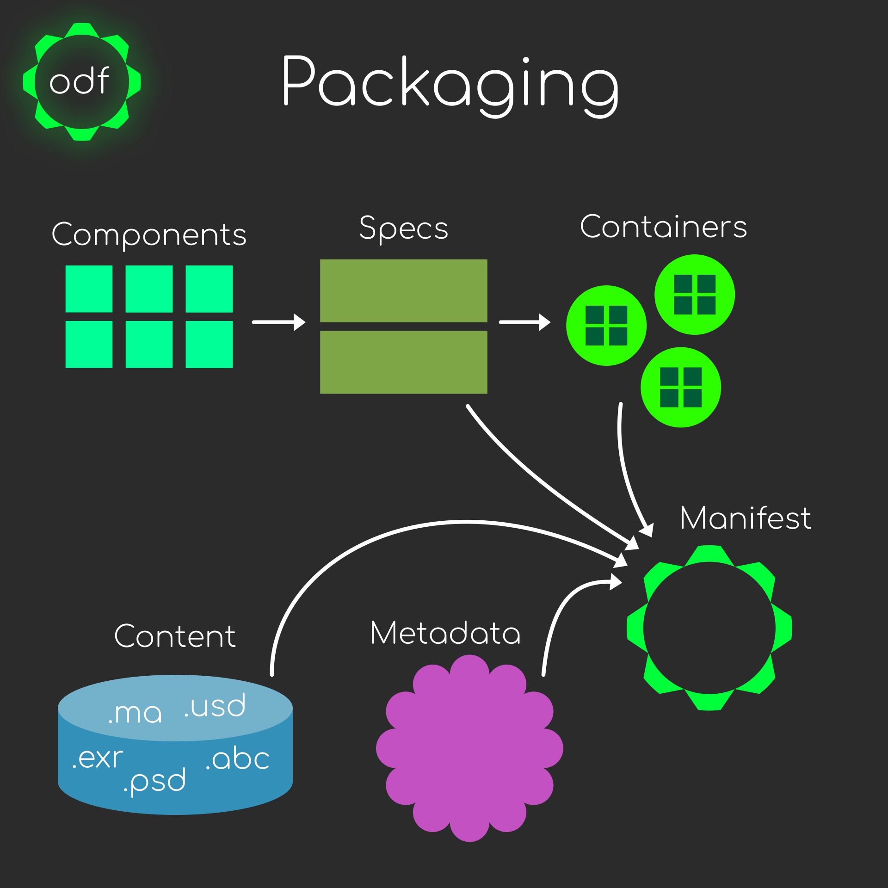

Packaging
=========
Before we get into the nitty-gritty of the system, let's go through how the protocol handles packaging and unpacking. Consider the below figure.

-

Making a Spec
-------------
Sometimes the simplest way to start is with the spec. Nearly all items in ODF can be boiled down to a YAML or JSON file. Specs are made by the initiator of the transaction to describe the work or information and, optionaly, how they would like it to be returned.

There are two main sections to the spec. ``work`` and ``delivery``. The former is how we describe a body of work or general metadata for whoever is recieving the package. The latter is for those who want to handle returning information after the ``work`` section is complete.

It's important to note that physical files is not the only reason to create a spec. OpenDeliveryFormat is designed to also transmit pure metadata for things like updating two or more divergent management systems (e.g. Flux <-> Shotgun <-> NIM).

Example
+++++++

A sample Spec might look like:

.. code-block:: yaml

    # vfx-paint.spec
    name: vfx-paint

    work:
      container: shot
      components:
        - plate:
          name: main-plates
          sub_components:
            - note
            - .annotation
            - .frame_range

    delivery:
      container: shot
      required_components:
        plate:
          paint/output/{container.name}/plate/{container.name}_src{work.plate.version}_v{container.version:03}.%0{work.plate.padding}d.{work.plate.extension}
        quicktime:
          paint/output/{container.name}/qt/{container.name}_src{work.plate.version}_v{container.version:03}.mp4
        nuke_script:
          paint/output/{container.name}/script/{container.name}_src{work.plate.version}_v{container.version:03}.nk

The ``name`` is a unique identifier for the spec. You cannot have two specs with the same name in a single manifest.

Hopefuly it's fairly human-readable. Let's break down the ``work`` section:

.. code-block:: yaml

    container: shot

ODF defines a few distinct containers types.